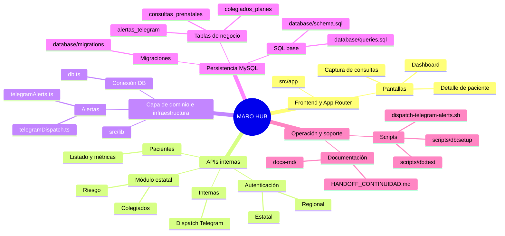
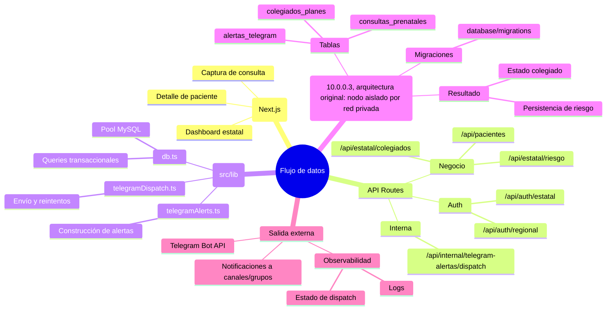
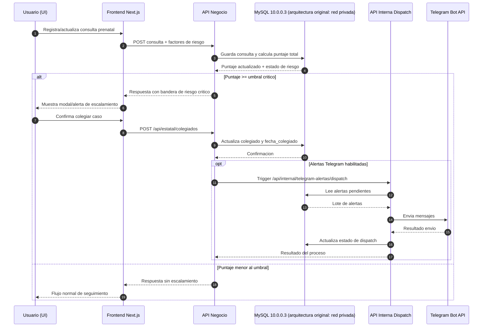

# HANDOFF DE CONTINUIDAD - MARO HUB

## Índice
1. [Objetivo de este documento](#1-objetivo-de-este-documento)
2. [Stack y estructura clave](#2-stack-y-estructura-clave)
3. [Modelo de datos mínimo (tablas clave)](#3-modelo-de-datos-mínimo-tablas-clave)
4. [Reglas de negocio clave](#4-reglas-de-negocio-clave)
5. [Estado funcional actual (alto nivel)](#5-estado-funcional-actual-alto-nivel)
6. [Base de datos y migraciones](#6-base-de-datos-y-migraciones)
7. [Operación de BD privada](#7-operación-de-bd-privada-10003-referencia-de-arquitectura-original)
8. [Pendientes críticos de seguridad](#8-pendientes-críticos-de-seguridad-prioridad-alta)
9. [Riesgos funcionales actuales](#9-riesgos-funcionales-actuales)
10. [Verificaciones rápidas](#10-verificaciones-rápidas)
11. [Despliegue a producción](#11-despliegue-a-producción)
12. [Apartados con código para debuggear](#12-apartados-con-código-para-debuggear)
13. [Advertencias de código legacy y decisiones históricas](#13-advertencias-de-código-legacy-y-decisiones-históricas)
14. [Plan sugerido de continuidad (7-10 días)](#14-plan-sugerido-de-continuidad-7-10-días)
15. [Nota sobre documentación histórica](#15-nota-sobre-documentación-histórica)
16. [Contacto técnico para continuidad](#16-contacto-técnico-para-continuidad)
17. [Glosario](#17-glosario)

## 1) Objetivo de este documento
Este archivo resume el estado técnico actual del proyecto.
Incluye:
- Arquitectura y módulos críticos
- Cambios funcionales recientes
- Pendientes de seguridad (priorizados)
- Guía operativa de base de datos en red privada (`10.0.0.3`, usado en mi arquitectura original con nodo aislado y comunicación solo por red privada)
- Próximos pasos sugeridos

## 2) Stack y estructura clave
- Framework: Next.js (App Router) + React + TypeScript
- Base de datos: MySQL (`mysql2/promise`)
- Frontend y APIs conviven en `src/app`
- Utilidades de infraestructura en `src/lib`
- Migraciones SQL en `database/migrations`
- Scripts operativos en `scripts`

Rutas clave de referencia:
- Conexión DB: `src/lib/db.ts`
- Login estatal: `src/app/api/auth/estatal/route.ts`
- Login regional: `src/app/api/auth/regional/route.ts`
- Riesgo estatal: `src/app/api/estatal/riesgo/route.ts`
- Colegiados (GET/POST): `src/app/api/estatal/colegiados/route.ts`
- Telegram (envío/dispatcher): `src/lib/telegramAlerts.ts`, `src/lib/telegramDispatch.ts`
- Trigger interno dispatcher Telegram: `src/app/api/internal/telegram-alertas/dispatch/route.ts`
- Dashboard pacientes API: `src/app/api/pacientes/route.ts`

### Mapa mental de arquitectura

### Mapa mental de flujo de datos (UI -> API -> DB -> Telegram)

### Diagrama secuencial: consulta con riesgo crítico

## 3) Modelo de datos mínimo (tablas clave)

#### `consultas_prenatales`
- Registro transaccional por control prenatal; se relaciona con paciente por `paciente_id`.
- Guarda signos y datos clinicos de cada consulta (TA, glucosa, proteinuria, edema, etc.).
- Persiste resultados de riesgo por consulta: `puntaje_consulta_parametros`, `puntaje_total_consulta`, `riesgo_25_plus`.
- Soporta flujo estatal de escalamiento con `colegiado` y `fecha_colegiado`.

#### `colegiados_planes`
- Define el plan de seguimiento del caso escalado a colegiado (1 plan por consulta).
- Vincula `consulta_id` y `paciente_id` para trazabilidad clinica completa.
- Maneja estado operativo del plan (`borrador` o `completo`) y observaciones.
- Se complementa con `colegiados_acciones` para tareas por nivel de atencion.

#### `alertas_telegram`
- Implementa patron outbox para desacoplar el envio de alertas del guardado clinico.
- Registra contexto minimo de evento (`paciente_id`, `consulta_id`, `tipo`, `puntaje_total`, `payload_json`).
- Controla ciclo de entrega con `estado`, `intentos`, `error_ultimo` y `enviado_en`.
- Evita duplicados por consulta+tipo con llave unica `uq_alerta_consulta_tipo`.

#### `pacientes` (tabla real: `cat_pacientes`)
- Entidad maestra de persona gestante, identificacion territorial y datos demograficos.
- Contiene antecedentes/factores base usados para puntaje de riesgo inicial.
- Persiste acumulados de riesgo: `factor_riesgo_antecedentes`, `factor_riesgo_tamizajes`.
- Incluye factores epidemiologicos estructurados (`factores_riesgo_epid`) para calculo clinico.

#### `historial_factor_riesgo` (tabla relacionada a riesgo)
- Bitacora de recalculos de riesgo para auditoria y trazabilidad temporal.
- Guarda `puntaje_total`, `categoria` y `detalles` en JSON por evento de calculo.
- Se relaciona por `caso_id` (flujo historico de la tabla `casos`).
- Util para analitica y verificacion clinica de reglas de puntuacion.

## 4) Reglas de negocio clave

#### Cuando un caso se considera colegiado
- Un caso queda colegiado cuando la consulta en `consultas_prenatales` tiene `colegiado = 1`.
- Si existe la columna, se registra `fecha_colegiado = NOW()` al marcarlo desde API estatal.
- La API de planes (`/api/colegiados/[id]`) exige ese estado; si no esta colegiado, no permite consultar/guardar plan.
- Restriccion principal: por paciente solo debe existir un colegiado activo a la vez.

#### Como se calcula riesgo
- Puntaje de consulta (`puntaje_consulta_parametros`) se calcula con: TA sistolica, TA diastolica, FC, indice de choque y temperatura.
- Puntaje total de consulta = `factor_riesgo_antecedentes + factor_riesgo_tamizajes + puntaje_consulta_parametros`.
- Regla de forzado a umbral: si hay cardiopatia/nefropatia/hepatopatia/coagulopatias, o edad 10-14, o IMC >= 31, el total minimo se fuerza a 25.
- `riesgo_25_plus = 1` cuando `puntaje_total_consulta >= 25`; en caso contrario, `0`.

#### Que dispara alertas
- Se encola alerta cuando se crea consulta y `riesgo_25_plus = 1`.
- Solo aplica si `TELEGRAM_ALERTS_ENABLED=true`.
- Se inserta registro en `alertas_telegram` con tipo `RIESGO_25_PLUS` (idempotente por `consulta_id + tipo`).
- Tras encolar, se intenta dispatch inmediato; adicionalmente puede ejecutarse por endpoint interno/cron para pendientes.

#### Que condiciones generan `409`
- En colegiacion estatal (`POST /api/estatal/colegiados`): cuando el paciente ya tiene otra consulta marcada como colegiada.
- En plan colegiado (`GET/PUT /api/colegiados/[id]`): cuando la consulta existe pero aun no esta marcada como colegiada.
- En ambos casos el `409` expresa conflicto de estado de negocio, no error tecnico de infraestructura.

#### Que significa "ultima consulta" en deduplicacion
- En listados deduplicados por paciente (riesgo/colegiados/dashboard), la ultima consulta se obtiene como `MAX(id)` por `paciente_id`.
- En la accion de colegiar por `paciente_id` (sin `consulta_id` explicito), se usa `ORDER BY fecha_consulta DESC, id DESC`.
- Criterio practico: se asume que mayor `id` representa la version mas reciente para consolidar una fila por paciente.
- Si hubiera cargas fuera de orden temporal, conviene normalizar hacia un criterio unico para evitar discrepancias.

## 5) Estado funcional actual (alto nivel)
### Flujo estatal/colegiados
- Existe módulo estatal con seguimiento de pacientes de riesgo.
- Se puede colegiar un caso desde detalle estatal.
- La data de colegiado se persiste en `consultas_prenatales` (`colegiado`, `fecha_colegiado`) por migración.
- Regla de negocio implementada: un paciente no debe terminar con dos casos colegiados activos; la API devuelve `409` si ya hay un colegiado previo.
- El módulo de colegiados lista casos deduplicados por paciente (tomando el último colegiado).

### Flujo usuario base
- En detalle de paciente se muestra estatus colegiado y fecha cuando aplica.
- En captura de consultas se muestra alerta/modal cuando el riesgo alcanza umbral crítico y el caso debe escalarse.

### Dashboard
- Se agregaron columnas con:
  - Puntaje de última consulta
  - Total actual
- Exportación Excel actualizada con estas columnas.

## 6) Base de datos y migraciones
### Migraciones relevantes recientes
- `20260225_add_consultas_colegiado.sql`
- `20260310_create_alertas_telegram.sql`
- `20260324_create_colegiados_planes.sql`

### Orden operativo recomendado
1. Respaldar base de datos antes de cambios estructurales.
2. Ejecutar migraciones en orden cronológico.
3. Validar columnas nuevas con `SHOW COLUMNS` y tablas nuevas con `SHOW TABLES`.
4. Probar endpoints críticos (riesgo, colegiados, dashboard).

## 7) Operación de BD privada (`10.0.0.3`, referencia de arquitectura original)
### Contexto
- La app está preparada para tomar conexión por variables de entorno.
- El host privado esperado es `10.0.0.3` (en mi arquitectura original: nodo de BD aislado, accesible solo por red privada).

### Variables mínimas requeridas
- `DB_HOST=10.0.0.3` (en mi arquitectura original; ajustar al host privado real de tu entorno)
- `DB_PORT`
- `DB_USER`
- `DB_PASSWORD`
- `DB_NAME`

### Runbook corto (entorno local o servidor)
1. Verificar alcance de red hacia `10.0.0.3:3306` (en mi arquitectura original; en otros entornos usar el endpoint privado correspondiente).
2. Confirmar credenciales válidas y permisos del usuario MySQL.
3. Ejecutar prueba de conexión y CRUD básico:
   - `npm run db:test`
4. Si se inicializa esquema desde cero:
   - `npm run db:setup`
5. Ejecutar migraciones pendientes (manual/automatizado según entorno).
6. Validar endpoints de negocio y logs de error.

### Señales de falla comunes
- `ECONNREFUSED`: MySQL no disponible o puerto bloqueado.
- `ER_ACCESS_DENIED_ERROR`: credenciales/host no autorizados.
- `Unknown database`: `DB_NAME` incorrecto o esquema no creado.
- Timeouts intermitentes: revisar red privada, firewall y latencia.

## 8) Pendientes críticos de seguridad (prioridad alta)
### P0 - aplicar de inmediato
1. Eliminar credenciales por defecto hardcodeadas en autenticación:
   - `src/app/api/auth/estatal/route.ts`
   - `src/app/api/auth/regional/route.ts`
   Actualmente existen usuarios/contraseñas de fallback en código; esto es un riesgo crítico.
2. Quitar logs sensibles de autenticación regional.
   - Hoy se imprimen datos de validación de contraseña en logs.
3. Rotar secretos actuales en entorno:
   - DB password
   - Credenciales de login estatales/regionales
   - `TELEGRAM_BOT_TOKEN`
   - `TELEGRAM_WORKER_TOKEN`

### P1 - siguiente bloque
1. Reemplazar autenticación por contraseña compartida con esquema robusto:
   - Hash (argon2/bcrypt) y almacenamiento seguro
   - Sesiones firmadas/JWT con expiración
   - Rate limiting y lockout por intentos fallidos
2. Endurecer endpoint interno de dispatcher Telegram:
   - Requerir token siempre (sin bypass si variable ausente)
   - Limitar IP/origen y registrar auditoría
3. Añadir validación de entrada consistente (zod/yup equivalente) en APIs críticas.

### P2 - hardening continuo
1. Política de rotación de secretos (trimestral o semestral).
2. Integrar escaneo de secretos y SAST en CI.
3. Definir checklist de seguridad pre-release.

## 9) Riesgos funcionales actuales
1. Si no se ejecutan migraciones, algunas funciones se degradan silenciosamente (hay checks de columnas, pero no corrige faltantes).
2. El flujo de colegiados depende de consistencia en `consultas_prenatales` y última consulta por paciente.
3. Alertas Telegram dependen de variables de entorno y del endpoint interno de dispatch.

## 10) Verificaciones rápidas
1. `npm install`
2. Configurar `.env.local` con secretos reales (no usar defaults de código).
3. `npm run dev`
4. `npm run db:test`
5. Probar manualmente:
   - Login estatal/regional
   - Escalamiento de riesgo en consultas
   - Colegiar caso y validación de duplicado
   - Dashboard con columnas de puntaje
   - Dispatch de alertas Telegram (si está habilitado)

## 11) Despliegue a producción
### Comandos base
1. Instalar dependencias:
   - `npm install`
2. Compilar aplicación:
   - `npm run build`
3. Levantar servidor productivo:
   - `npm run start`

### Variables obligatorias en producción
#### Base de datos (obligatorias)
- `DB_HOST`
- `DB_PORT`
- `DB_USER`
- `DB_PASSWORD`
- `DB_NAME`

#### Autenticación (obligatorias para evitar fallback inseguro)
- `ESTATAL_USER`
- `ESTATAL_PASSWORD`
- `REGIONAL_PASSWORD`

#### Telegram (obligatorias si alertas están activas)
- `TELEGRAM_ALERTS_ENABLED` (`true`/`false`)
- Si `TELEGRAM_ALERTS_ENABLED=true`:
  - `TELEGRAM_BOT_TOKEN`
  - `TELEGRAM_CHAT_IDS` (o `TELEGRAM_CHAT_ID`)
  - `TELEGRAM_WORKER_TOKEN` (requerido para endpoint interno y script de dispatch)

### Advertencias de entorno
- Si faltan variables de DB, el servicio puede levantar pero fallar en runtime al tocar APIs.
- Si `TELEGRAM_ALERTS_ENABLED=true` y faltan token/chat IDs, las alertas quedarán en error o pendientes reintentables.
- El endpoint interno de dispatch hoy acepta llamadas sin token cuando `TELEGRAM_WORKER_TOKEN` está ausente; en producción no dejarlo vacío.
- Verificar sincronía de migraciones antes de arrancar (`colegiado`, `fecha_colegiado`, `puntaje_total_consulta`, `riesgo_25_plus`).

## 12) Apartados con código para debuggear
### A) Diagnóstico de base de datos
- Script principal de verificación: `npm run db:test`.
- Archivo: `scripts/test-database.ts`.
- Cubre ping de conexión, existencia de tablas, `DESCRIBE`, CRUD de prueba y conteos.
- Útil para aislar fallas de red/credenciales/esquema antes de revisar APIs.

### B) Debug de cola y envío Telegram
- Trigger interno de despacho: `src/app/api/internal/telegram-alertas/dispatch/route.ts`.
- Lógica de retry/estado: `src/lib/telegramDispatch.ts` (procesados, enviados, fallidos, skipped).
- Integración con Telegram API: `src/lib/telegramAlerts.ts` (timeout, destinos, errores parciales).
- Script operativo para cron/manual: `scripts/dispatch-telegram-alerts.sh` (log en archivo, código HTTP y body).

### C) Endpoints de negocio con trazas de error
- Riesgo estatal: `src/app/api/estatal/riesgo/route.ts` (incluye fallback si falla consulta principal).
- Colegiados estatal: `src/app/api/estatal/colegiados/route.ts` (errores de lectura/marcado).
- Consultas prenatales: `src/app/api/consultas/route.ts` (errores de guardado y encolado/dispatch de alertas).
- Pacientes y métricas: `src/app/api/pacientes/route.ts` (errores en generación de folio, métricas y alta).

### D) Logs de depuración sensibles (revisar/limpiar)
- Login regional imprime usuario y comparación de contraseñas: `src/app/api/auth/regional/route.ts`.
- Búsqueda de configuración regional imprime comparaciones por usuario: `src/lib/regiones.ts`.
- Estos logs sirven para debug rápido de auth, pero son riesgo en producción y deben restringirse.

### E) Frontend/hooks con logs de apoyo
- Guardado de factor de riesgo: `src/lib/hooks/useSaveFactorRiesgoPaciente.ts` (log de éxito/error).
- Cálculo de factor de riesgo en hook: `src/lib/hooks/useFactorRiesgo.ts` (captura y log de error).
- Contador de riesgo: `src/lib/hooks/useContadorRiesgo.ts` (ejemplos de uso con logs en comentarios).
- Útil para validar flujo UI/API durante pruebas manuales en local.

## 13) Advertencias de código legacy y decisiones históricas
### 1) Fallback en autenticación (temporal)
- Existe fallback hardcodeado para login estatal/regional cuando faltan variables de entorno.
- Se mantuvo para continuidad operativa en etapas de despliegue inicial y entornos incompletos.
- No es objetivo de largo plazo: ya está marcado como deuda P0 y debe eliminarse tras estabilizar secrets.

### 2) Dispatcher como endpoint interno
- El dispatch de Telegram está expuesto como endpoint interno para ejecución por cron y disparo inmediato desde flujo de negocio.
- Esta forma permite desacoplar guardado clínico de envío externo (patrón outbox), reduciendo latencia percibida en UI.
- También permite reintentos controlados y observabilidad centralizada del estado (`pendiente`, `enviado`, `error`).

### 3) Cálculo de riesgo distribuido (paciente + consulta)
- El riesgo total combina acumulados de paciente (`factor_riesgo_antecedentes`, `factor_riesgo_tamizajes`) con signos de la consulta actual.
- Esto responde a un criterio clínico mixto: riesgo basal longitudinal + evento agudo de consulta.
- Por diseño, parte del cálculo vive en `cat_pacientes` y parte en `consultas_prenatales`; no consolidar sin validar impacto clínico y reportes.

### 4) Deduplificación por "última consulta"
- En varios listados se usa `MAX(id)` por paciente para consolidar una sola fila.
- En otras rutas se usa `ORDER BY fecha_consulta DESC, id DESC`.
- La coexistencia es histórica por compatibilidad; unificar criterio requiere plan de migración y pruebas de regresión en dashboard/estatal.

## 14) Plan sugerido de continuidad (7-10 días)
1. Día 1-2: cerrar P0 de seguridad y rotar secretos.
2. Día 3-4: migrar auth a esquema seguro y remover password compartida regional.
3. Día 5-6: endurecer dispatcher Telegram + observabilidad.
4. Día 7-8: pruebas e2e de flujos críticos (consulta-riesgo-estatal-colegiado).
5. Día 9-10: documentación final y checklist de release.

## 15) Nota sobre documentación histórica
- Se movió documentación histórica a carpeta `docs-md/`.
- Esta carpeta está ignorada por git actualmente.
- Este archivo se deja en raíz a propósito para continuidad operativa inmediata.

## 16) Contacto técnico para continuidad
Este handoff es el documento técnico principal para continuidad operativa, mantenimiento y transferencia de conocimiento del sistema MARO HUB.

Para consultas técnicas, aclaraciones sobre arquitectura, reglas de negocio, despliegue, migraciones o diagnóstico de incidencias, se deja el siguiente canal de contacto:

📧 marohub_legacy@filenode.dev

## 17) Glosario
- **CPN (Control Prenatal):** Consulta periódica de seguimiento clínico durante el embarazo.
- **Consulta prenatal:** Registro clínico puntual en `consultas_prenatales` con signos, puntajes y estado de riesgo.
- **Riesgo 25+:** Bandera de riesgo crítico cuando `puntaje_total_consulta >= 25`.
- **Colegiado:** Estado de una consulta escalada (`colegiado = 1`) para seguimiento estatal y plan de acciones.
- **Caso colegiado activo:** Restricción de negocio que evita múltiples colegiados simultáneos para el mismo paciente.
- **Outbox de alertas:** Patrón de persistencia en `alertas_telegram` para desacoplar guardado clínico y envío externo.
- **Dispatch:** Proceso que consume alertas pendientes y ejecuta envío a Telegram con reintentos.
- **Última consulta:** Criterio de deduplicación por paciente (usualmente `MAX(id)` o `fecha_consulta DESC, id DESC`).
- **Factor de riesgo por antecedentes:** Puntaje acumulado histórico del paciente (`factor_riesgo_antecedentes`).
- **Factor de riesgo por tamizajes:** Puntaje acumulado por tamizajes iniciales (`factor_riesgo_tamizajes`).
- **Puntaje de consulta:** Puntaje de parámetros clínicos capturados en la consulta actual (`puntaje_consulta_parametros`).
- **Puntaje total actual:** Suma usada para decisión clínica y alertamiento (`puntaje_total_consulta`).
- **Endpoint interno:** Ruta API no pública para operación técnica (ej. dispatcher Telegram).
- **Fallback (temporal):** Comportamiento de respaldo para continuidad operativa cuando faltan configuraciones/migraciones.
